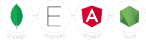

<div id="top"></div>

[![Forks][forks-shield]][forks-url]
[![Stargazers][stars-shield]][stars-url]
[![MIT License][license-shield]][license-url]
[![LinkedIn][linkedin-shield]][linkedin-url]

<!-- PROJECT LOGO -->
<br />
<div align="center">
  <a href="https://github.com/rinaldilucas/mean-stack-template">
    
  </a>

  <h3 align="center">MEAN Stack Crud Template</h3>

  <p align="center">
    Project built using Angular, NodeJS, Express.js<br> and MongoDB with Angular Material to jumpstart your studies!
    <br />
    <a href="https://github.com/rinaldilucas/mean-stack-template"><strong>Explore the docs »</strong></a>
    <br />
    <br />
    <a href="https://rinaldilucas.github.io/mean-stack-template/">View App (without backend)</a>
    · 
    <a href="#donations">Donate</a>       
  </p>
</div>

<!-- TABLE OF CONTENTS -->
<details>
  <summary>Table of Contents</summary>
  <ol>
    <li>
      <a href="#about-the-project">About The Project</a>
      <ul>
        <li><a href="#built-with">Built With</a></li>
      </ul>
    </li>
    <li>
      <a href="#getting-started">Getting Started</a>
      <ul>
        <li><a href="#prerequisites">Prerequisites</a></li>
        <li><a href="#installation">Installation</a></li>
      </ul>
    </li>
    <li><a href="#usage">Usage</a></li>
    <li><a href="#contributing">Contributing</a></li>
    <li><a href="#license">License</a></li>
    <li><a href="#contact">Contact</a></li>
    <li><a href="#donations">Donations</a></li>
  </ol>
</details>

<!-- ABOUT THE PROJECT -->

## About The Project

<div align="center">

[![Project Screenshot][project-screenshot]](https://rinaldilucas.github.io/mean-stack-template/)

</div>

I built this project to make a cool template for those who wants to learn the MEAN stack. If this repository helped you, don't hesitate to leave a star!<br><br>It has really cool features like:

-   Node.js API written with TypeScript
-   Built with yarn as package manager
-   Multilingual features implemented in both the client-side and API responses
-   Examples of autocomplete, mat-chips, calendar, dialogs, bottomsheet and more
-   Routed bottom sheet example implemented using only one component
-   Virtual scrolling feature implemented on tables
-   Charts using chart.js library
-   Angular routing animations using dynamic params
-   Search and ordering features via the database to minimize request size
-   AJAX requests used for pagination and search
-   JWT implementation with refresh token using Redis and cookies on strict mode
-   Blacklist of access/refresh token
-   Authentication and role guard
-   Multiple examples of syncronous custom validators
-   Custom async validator to check already registered user
-   Register with strong password validator
-   Password encryption using bcrypt with salt rounds
-   Authentication with brute force prevention using ExpressBrute
-   Example using resolver guard to retrieve data
-   Interceptor modules added to verify bearer token, errors, and headers language
-   Error handlers implemented throughout the project to improve readability and correctly throw HTTP errors and messages when necessary, making it easier to plug-in frontend, backend or database individually
-   Front-end validation on requests and inputs
-   Backend (API) validation on controllers and routes using express-validator, which improves error readability using third-party software such as Insomnia and Postman
-   Database and model validation using mongoose
-   API documentation using Swagger
-   Handler of promises and errors using destructuring
-   Improved http security using HttpParams
-   Unsubscriber component with subsink to facilitate the manuvering of unsubcribres
-   Shared CRUD service, allowing services to inherit its operations
-   Custom pipes to convert date to selected language
-   Custom directive to prevent form autofill
-   Dark mode persistent trought browser cookies
-   SCSS algorythm which uses rem unit to maintain aspect ratio
-   Stylesheets written using BEM methodology
-   Custom SCSS structure to improve reusability
-   Material components are overwritten to support rem unit and improve mobile/table compatibility coding less
-   Improved readability on media queries using include-media library
-   Helper query interface to maneuver http responses
-   Custom ESLint rules implemented which work both on the client-side and API
-   Keyboard accessibility, ARIA and accessible HTML ESLint rules
-   Implementation of sass-lint which guarantees the order of css properties, maintaining the writing pattern and avoiding unnecessary code revisions
-   Prettier rules implemented to improve code readability
-   Input validators with multilingual features added

<p align="right">(<a href="#top">back to top</a>)</p>

### Built With

This section shows what technologies are used in this particular project.

-   [Angular](https://angular.io/)
-   [NodeJS](https://nodejs.org/en/)
-   [MongoDB](https://www.mongodb.com/)
-   [Express.js](https://expressjs.com/)
-   [Redis](https://redis.io/)
-   [Swagger](https://swagger.io/)
-   [Chart.js](https://www.chartjs.org/)
-   [Angular Material](https://material.angular.io/)

<p align="right">(<a href="#top">back to top</a>)</p>

<!-- GETTING STARTED -->

## Getting Started

After cloning the project, you need to do a few things to be able to run it.

### Prerequisites

You need to have the following requirements:

-   mongodb <a target="_blank" href="https://www.mongodb.com/try/download/community/">(download here)</a>
-   node 16.14 <a target="_blank" href="https://nodejs.org/en/download/">(download here)</a>
-   redis <a target="_blank" href="https://redis.io/download/">(download here for linux)</a> or <a target="_blank" href="https://github.com/tporadowski/redis/releases">(download here for windows)</a>

-   yarn

    ```sh
    npm install -g yarn
    ```

-   angular cli 14

    ```sh
    npm install -g @angular/cli@14
    ```

### Installation

_Below is an example of how you can run the project._<br>
_More scripts at package.json_

1. Clone the repo
    ```sh
    git clone https://github.com/rinaldilucas/mean-stack-template.git
    ```
2. Install NPM packages via yarn
    ```sh
    yarn install
    ```
3. If running for the first time, run the following command to answer angular cli questions
    ```js
    ng serve
    ```
4. Run angular, express and mongoDB as development mode
    ```js
    yarn dev
    ```
5. Deploy to github pages
    ```js
    yarn deploy
    ```
    If needed, you can debug express using `yarn api-debug`. <br>More builds scripts at `./package.json`. <br>

<p align="right">(<a href="#top">back to top</a>)</p>

<!-- USAGE EXAMPLES -->

## Usage

You can import the Insomnia routes via file `./db/routes-collection.json` and import the mongodb collections via file `./db/colletions`. <br>Below are the implemented routes: you also can view them inside `./api/routes` folder or through the Swagger documentation at `http://localhost:3000/api-docs/`.

```js
-------------------------------
-------- [AUTH ROUTES] --------
-------------------------------
[POST] localhost:3000/api/auth/authenticate -> 'authenticate'
[POST] localhost:3000/api/auth/register -> 'register'
[GET] localhost:3000/api/auth/email-exists/:email -> 'checkIfEmailExists'
[PUT] localhost:3000/api/auth/changePassword -> 'changePassword'
[POST] localhost:3000/api/auth/refresh -> 'refreshToken'
[POST] localhost:3000/api/auth/logout -> 'logout'
```

```js
-------------------------------
-------- [TASK ROUTES] --------
-------------------------------
[GET] localhost:3000/api/tasks?pageSize&searchTerm&pageIndex&sortFilter&sortDirection&startDate&finalDate -> 'findAll'
[POST] localhost:3000/api/tasks -> 'create'
[PUT] localhost:3000/api/tasks -> 'update'
[DELETE] localhost:3000/api/tasks/:_id -> 'remove'
[GET] localhost:3000/api/tasks/:_id -> 'findOne'
```

```js
-------------------------------
------ [CATEGORY ROUTES] ------
-------------------------------
[GET] localhost:3000/api/categories -> 'findAll'
[POST] localhost:3000/api/categories -> 'create'
[DELETE] localhost:3000/api/categories/:_id -> 'remove'
```

<p align="right">(<a href="#top">back to top</a>)</p>

<!-- CONTRIBUTING -->

## Contributing

Contributions are what make the open source community such an amazing place to learn, inspire, and create. Any contributions you make are **greatly appreciated**.

If you have a suggestion that would make this better, please fork the repo and create a pull request. You can also simply open an issue with the tag "enhancement".
Don't forget to give the project a star! Thanks again!

1. Fork the Project
2. Create your Feature Branch (`git checkout -b feature/AmazingFeature`)
3. Commit your Changes (`git commit -m 'Add some AmazingFeature'`)
4. Push to the Branch (`git push origin feature/AmazingFeature`)
5. Open a Pull Request

<p align="right">(<a href="#top">back to top</a>)</p>

<!-- LICENSE -->

## License

Distributed under the MIT License. See [LICENSE](./LICENSE) for more information.

<p align="right">(<a href="#top">back to top</a>)</p>

<!-- CONTACT -->

## Contact

[](https://rinaldilucas.com)
[](https://github.com/rinaldilucas)
[](mailto:lucasreinaldi@gmail.com)
[](mailto:lucasreinaldi@hotmail.com)
[](https://www.linkedin.com/in/rinaldilucas/)
[](https://t.me/rinaldilucas)

Project Link: [https://github.com/rinaldilucas/mean-stack-template](https://github.com/rinaldilucas/mean-stack-template)

<p align="right">(<a href="#top">back to top</a>)</p>

<!-- ACKNOWLEDGMENTS -->

## Donations

If you feel that this project has helped you in any way, whether it's attracting clients or teaching you about the technologies used, feel free to make a donation.
It helps me a lot to continue developing open source codes.

-   Metamask (USDT):
    ```sh
    0xA0410641515F06fF6a9AdAFf1c3e90a3905ba271
    ```
-   PIX (BRL):
    ```sh
    72140bc8-fadc-42f5-abb6-9c13cc80a59f
    ```

<p align="right">(<a href="#top">back to top</a>)</p>

<!-- MARKDOWN LINKS & IMAGES -->
<!-- https://www.markdownguide.org/basic-syntax/#reference-style-links -->

[contributors-shield]: https://img.shields.io/github/contributors/rinaldilucas/mean-stack-template.svg?style=for-the-badge
[contributors-url]: https://github.com/rinaldilucas/mean-stack-template/graphs/contributors
[forks-shield]: https://img.shields.io/github/forks/rinaldilucas/mean-stack-template.svg?style=for-the-badge
[forks-url]: https://github.com/rinaldilucas/mean-stack-template/network/members
[stars-shield]: https://img.shields.io/github/stars/rinaldilucas/mean-stack-template.svg?style=for-the-badge
[stars-url]: https://github.com/rinaldilucas/mean-stack-template/stargazers
[license-shield]: https://img.shields.io/github/license/rinaldilucas/mean-stack-template.svg?style=for-the-badge
[license-url]: https://github.com/rinaldilucas/mean-stack-template/blob/master/LICENSE.txt
[linkedin-shield]: https://img.shields.io/badge/-LinkedIn-black.svg?style=for-the-badge&logo=linkedin&colorB=555
[linkedin-url]: https://www.linkedin.com/in/rinaldilucas/
[project-screenshot]: ./app/assets/images/_readme/screenshot.gif
